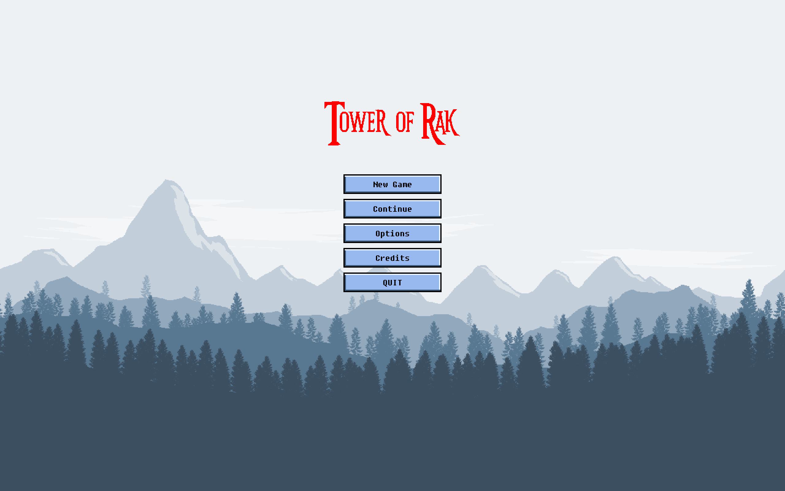
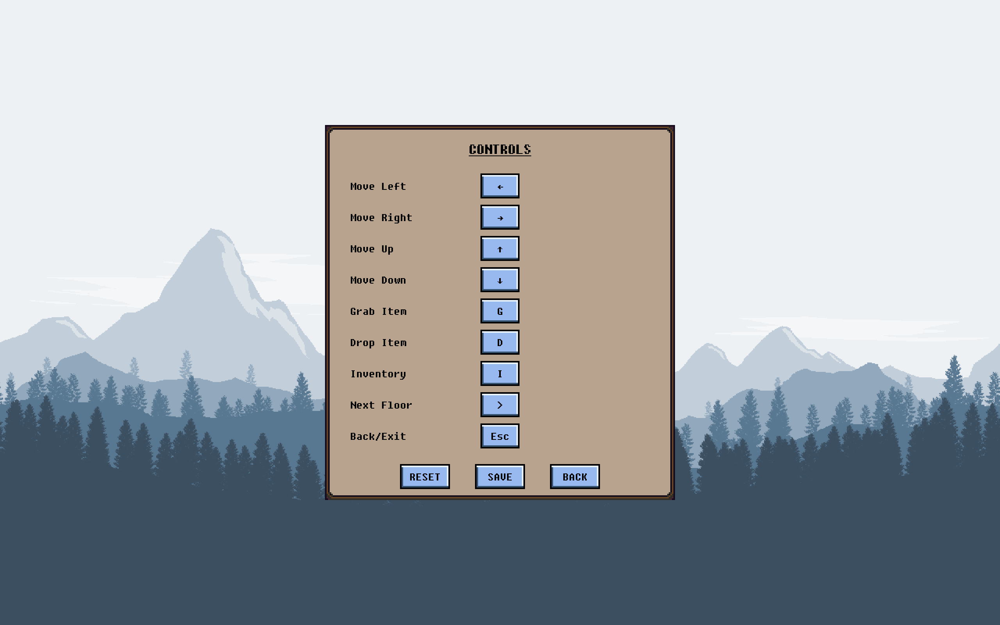
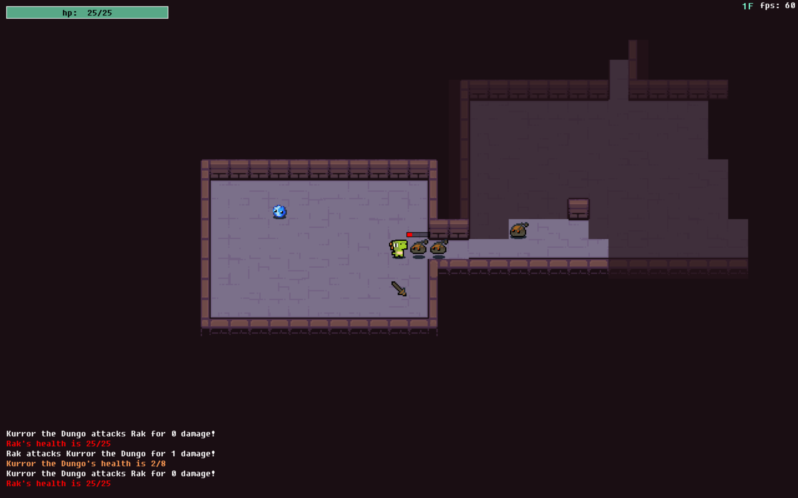
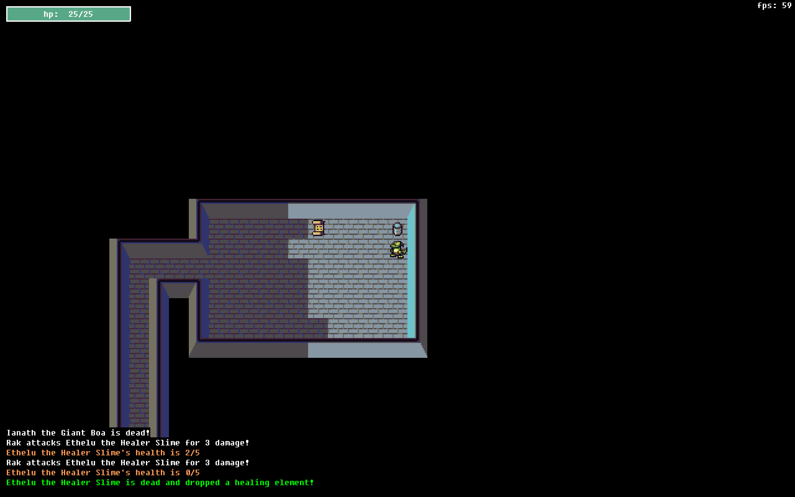

# Tower of Rak

Tower of Rak is a turned-based roguelike game inspired by [Tales of Maj'Eyal](https://te4.org/) and the webtoon [Tower of God](https://www.webtoons.com/en/fantasy/tower-of-god/list?title_no=95&page=1). Several [JRPG franchises](https://en.wikipedia.org/wiki/List_of_best-selling_Japanese_role-playing_game_franchises) also influenced the design and gameplay.

The game is set in a world of two opposing races, where the adventure begins as a young Gator hero sets out to conquer the ancient Tower of Rak, which is said to hold a legendary relic with immense powers. The hero seeks to free the Gators from the supression of the overwhelmingly dominant Teurtal race.

## Features
- pixel art graphics
- classic roguelike elements
  - turned-based gameplay
  - procedurally generated maps
  - permadeath
  
### Screenshots
&nbsp; 
&nbsp; 
  
## Download
The game can be downloaded as a zip file at the <a href="https://towerofrak.herokuapp.com/">official site</a>. Note that this is an **early demo** of the game for macOS only.  
- [py2app](https://pypi.org/project/py2app/) was used to bundle everything into this standalone Mac OS X application.

Unzip the file and simply open the application file to start playing.  

## Development Notes
Use pygame version 2.0.0.dev2 to solve game window display issue on macOS Mojave.  

As this game is still under development, please help by [reporting](https://github.com/PeterBohai/tower-of-rak/issues/new) any bugs or suggestions for new features.

### Built with
- [pygame](https://www.pygame.org/) (2.0.0.dev2)
- [tcod](https://pypi.org/project/tcod/) (6.0.6)
- [tdl](https://python-tcod.readthedocs.io/en/latest/tdl.html) (6.0.0)
- [numpy](https://numpy.org/) (1.17.0)

## Contributing
If you experience any bugs or see anything that can be improved or added, please feel free to [open an issue](https://github.com/PeterBohai/tower-of-rak/issues) here or simply contact me on any of my socials ([Linkedin](https://www.linkedin.com/in/peterhu08)). Thanks in advance!

## License
This project is licensed under the GNU General Public License v3.0 License - see the [LICENSE](LICENSE) file for details. The license does not cover the game content (artwork, audio, etc.), which are not included and can only be used with the appropriate attributions to the original owners.
